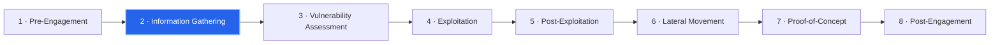

---
tags:
  - Material
  - CPTS
  - HTB
---
# Information Gathering

>The phase that begins once pre-engagement is complete and all contractual terms are signed. Here the tester gathers all available information about the company, its employees, its infrastructure, and how they are organized.

It is the ==most frequent and vital phase== of the whole process — testers return to it again and again. Every step taken to exploit vulnerabilities is based on the information enumerated about the targets, which makes this phase the ==cornerstone of any penetration test==.

---

## Penetration Testing Process

Information Gathering is stage 2.

---

## Four Categories

Information can come from anywhere — social media, job postings, individual hosts and servers, or the employees themselves. It divides into four categories, and **all four must be performed** for every penetration test:

1. Open-Source Intelligence
2. Infrastructure Enumeration
3. Service Enumeration
4. Host Enumeration

---

## Open-Source Intelligence (OSINT)

> Used to find what information is publicly available about a client's company on the internet.

OSINT is a process for finding publicly available information on a target company or individuals, allowing the identification of events (public and private meetings), external and internal dependencies, and connections. It uses public (open-source) information from freely available sources to obtain the desired results.

It is possible to find highly sensitive information — passwords, hashes, keys, tokens — that can grant network access within minutes. Repositories on sites like GitHub are often set up incorrectly, exposing this information to external viewers. Developers also share whole sections of code on StackOverflow, which can be found quickly and used against the company.

> [!important] Reporting sensitive findings If sensitive information (e.g. publicly published passwords or SSH keys) is found at the onset of testing, the **Incident Handling and Reporting** section of the RoE defines the procedure for reporting these critical vulnerabilities. Exposed credentials are a critical security gap unless already removed or changed, so the client's administrator must review this information before testing proceeds.

Further techniques are covered in the **OSINT: Corporate Recon** module.

---

## Infrastructure Enumeration

> Building an overview of the company's position on the internet and intranet, using OSINT and the first active scans.

Services such as DNS are used to map the client's servers and hosts — name servers, mail servers, web servers, cloud instances, and more — producing an accurate list of hosts and IP addresses that is compared against the scope.

This phase also identifies the company's security measures. The more precise this information is, the easier it is to disguise attacks (**Evasive Testing**). Identifying firewalls, such as web application firewalls (WAFs), reveals which techniques would trigger an alarm and which can avoid it.

Position does not matter — external (from outside) or internal (from inside the network). Internal enumeration reveals hosts and servers usable as targets for a Password Spraying attack.

> [!info] **Password Spraying** is An attack that uses one password to attempt authentication against as many different usernames as possible, hoping for one successful authentication to grant a foothold in the network.

---

## Service Enumeration

> Identifying services that allow interaction with the host or server over the network (or locally, from an internal perspective).

For each service, the tester determines what it is, its version, what information it provides, and why it is used. Understanding a service's purpose allows logical conclusions and opens several options.

A service's version history reveals whether the installed version is up to date; older versions often carry known vulnerabilities. Many administrators avoid changing working applications for fear of harming the infrastructure, so they often accept the risk of leaving vulnerabilities open in order to preserve functionality.

---

## Host Enumeration

> Examining every host in the scoping document to identify its operating system, services, and service versions.

Once a detailed infrastructure list exists, active scans and OSINT methods both help reveal how a host may be configured.

Common findings include services like an FTP server allowing anonymous access. Unsupported, outdated hosts still have discoverable vulnerabilities that endanger the whole infrastructure.

External or internal examination both apply. From the internal perspective, services often not reachable from outside appear; administrators frequently treat these as "secure" simply because they are not internet-facing, so misconfigurations are often found here. Host enumeration also determines each host's role, which components it communicates with, which services it uses, and on which ports.

Internal host enumeration usually follows successful exploitation of one or more vulnerabilities. The host is then examined from the inside for sensitive files, local services, scripts, applications, and other information — an essential part of the **Post-Exploitation** phase, where privileges are escalated.

---

## Pillaging

> **Pillaging** is the collection of sensitive information stored locally on an already-exploited host (e.g. employee names, customer data). It is performed only after exploiting the target host and gaining access.

The information obtainable varies greatly depending on the host's purpose, its position in the corporate network, and the administrator's security measures. It can demonstrate the impact of an attack and be used to escalate privileges or move laterally through the network.

HTB Academy has no module explicitly focused on pillaging, and this is intentional: pillaging is not a stage or subcategory on its own, but an integral part of the information gathering and privilege escalation stages, always performed locally on target systems. It is covered within other modules where relevant.

> [!info]- Modules where Pillaging is covered (reference)
> 
> - Network Enumeration with Nmap
> - Getting Started
> - Password Attacks
> - Active Directory Enumeration & Attacks
> - Linux Privilege Escalation
> - Windows Privilege Escalation
> - Attacking Common Services
> - Attacking Common Applications
> - Attacking Enterprise Networks

Across the Penetration Tester Job Role Path there are 150+ targets and nine simulated mini penetration tests, giving repeated practice on this topic.

---
