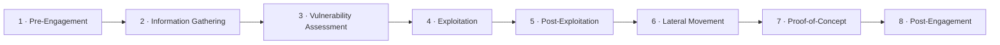

---
tags:
  - Material
  - HTB
  - CPTS
---
# Pre-Engagement

The preparation stage before the actual penetration test. The client defines what they want tested, while the tester defines how to run it efficiently and legally. This stage is purely legal and administrative — no active testing happens yet.

Its purpose is to establish **scope**, **authorization**, and **written consent**.

> [!warning] Legal basis Testing without proper authorization can breach the **Computer Misuse Act**. Consent must exist in written form before any testing begins.

---

## Penetration Testing Process

The full engagement follows this order. Pre-Engagement is stage 1.

---

## Three Components of Pre-Engagement

1. Scoping Questionnaire
2. Pre-Engagement Meeting
3. Kick-Off Meeting

Each feeds the next. An NDA must be signed by all parties before any of these are discussed in detail. In urgent cases, parties may jump straight to the kick-off meeting (possibly online).

---

## NDA Types

A **Non-Disclosure Agreement (NDA)** is a secrecy contract between the client and the contractor covering all written or verbal information about the project. The contractor agrees to treat all confidential information as strictly confidential, ==even after the project is completed==. It also stipulates any exceptions to confidentiality, transferability of rights and obligations, and contractual penalties.

|Type|Meaning|
|---|---|
|Unilateral|Only one party must keep information confidential; the other may share with third parties.|
|Bilateral|Both parties must keep information confidential. ==Most common type== — protects the pentester's work.|
|Multilateral|More than two parties commit to confidentiality (e.g. a cooperative network with multiple responsible parties).|

---

## Authorization to Test

>Only certain roles may legally contract a penetration test. A regular employee **cannot**. Example risk: an employee hires the tester claiming to check the network's security, but afterward it turns out they had no authorization and intended to harm their own company — this puts the tester in a critical legal position.

Example authorized roles (varies by company; larger orgs may delegate to IT / Audit / Security senior management instead of C-level):

`CEO` · `CTO` · `CISO` · `CSO` · `CRO` · `CIO` · `VP of Internal Audit` · `Audit Manager` · `VP/Director of IT or Information Security`

Determine early who has **signatory authority** for the contract and RoE documents, and who will be the primary and secondary points of contact, technical support, and the contact for escalating issues.

---

## Documents and Timing

>Required documents (list is "including but not limited to"). The Contractors Agreement (#6) applies **only** to physical assessments.

|#|Document|When Created|
|---|---|---|
|1|Non-Disclosure Agreement (NDA)|After initial contact|
|2|Scoping Questionnaire|Before the pre-engagement meeting|
|3|Scoping Document|During the pre-engagement meeting|
|4|Penetration Testing Proposal (Contract / Scope of Work)|During the pre-engagement meeting|
|5|Rules of Engagement (RoE)|Before the kick-off meeting|
|6|Contractors Agreement (physical assessments)|Before the kick-off meeting|
|7|Reports|During and after the test|

In-scope IPs / ranges / URLs and credentials may come as a separate scoping document but should also be attached as an appendix in the RoE.

> [!important] Lawyer review All documents should be reviewed and adapted by a lawyer after preparation.

---

## Scoping Questionnaire

>Sent after initial contact to understand the services the client needs. Explains the tester's services and lets the client select one or more assessment types:

> [!info]- Assessment Types
> - Internal Vulnerability Assessment
> - External Vulnerability Assessment
> - Internal Penetration Test
> - External Penetration Test
> - Wireless Security Assessment
> - Application Security Assessment
> - Physical Security Assessment
> - Social Engineering Assessment
> - Red Team Assessment
> - Web Application Security Assessment

Under each type, the questionnaire lets the client be more specific — e.g. web vs mobile application, whether a secure code review is included, whether an internal test should be black box and semi-evasive, or whether social engineering is phishing only or also includes vishing calls. This is the tester's chance to explain the depth and breadth of the services and confirm the client's expectations can be met.

It also collects the client name, address, and key personnel contact info, plus this sizing information:

>[!info]- Sizing Information
>- Expected number of live hosts.
>- Number of IPs / CIDR ranges in scope.
>- Number of domains / subdomains in scope.
>- Number of wireless SSIDs in scope.
>- Number of web/mobile apps, and how many roles (standard user, admin, etc.) if testing is authenticated.
>- For phishing: how many users targeted, and whether the client supplies the list or the tester gathers it via **OSINT**.
>- For physical assessments: how many locations, and whether multiple sites are geographically dispersed.
>- Red Team objective, and whether any activities (e.g. phishing or physical attacks) are out of scope.
>- Whether a separate Active Directory security assessment is wanted.
>- Whether network testing is from an anonymous user or a standard domain user.
>- Whether Network Access Control (**NAC**) must be bypassed.

Two framing questions:
- **Information disclosure** — black box (no info) / grey box (IP/CIDR/URL only) / white box (detailed info).
- **Evasiveness** — non-evasive / hybrid-evasive (start quiet, get louder to test detection) / fully evasive.

This information drives resource assignment, timeline, and cost. The results are summarized into the **Scoping Document**.

---

## Pre-Engagement Meeting

>Held once initial requirements are known. Walks the client through all essential components before testing. Inputs from this meeting plus the scoping questionnaire feed the **Penetration Testing Proposal** (Contract / SoW). Usually done via email and an online or in-person call. Part of the meeting may be used to review the questionnaire step-by-step for first-time clients.

The most important element is presenting the test in detail and identifying the client's priorities — each infrastructure and client is unique.

> [!info]- Contract Checklist (reference)
> 
> - **NDA** — confidentiality contract; signed before or during kick-off, before details are discussed.
> - **Goals** — milestones to achieve, from major to fine-grained.
> - **Scope** — components to test (domains, IP ranges, hosts, accounts, security systems); legal basis has highest priority.
> - **Penetration Testing Type** — present options with pros/cons and a justified recommendation; client decides.
> - **Methodologies** — e.g. OSSTMM, OWASP, vulnerability assessment, threat vectorization, verification/exploitation, exploit development.
> - **Locations** — External (remote via VPN) and/or Internal (on-site or remote via VPN).
> - **Time Estimation** — start/end dates; time windows per phase; in or outside working hours.
> - **Third Parties** — identify cloud/ISP/hosting providers; client must obtain and forward written consent from them.
> - **Evasive Testing** — whether the client wants evasion techniques used.
> - **Risks** — inform client of risks and consequences; set limitations and precautions.
> - **Scope Limitations & Restrictions** — identify critical systems to avoid so production isn't affected.
> - **Information Handling** — HIPAA, PCI, HITRUST, FISMA/NIST, etc.
> - **Contact Information** — name, title, emails, phones, escalation order.
> - **Lines of Communication** — email, phone, or in-person.
> - **Reporting** — structure, client-specific requirements, whether a presentation is wanted.
> - **Payment Terms** — prices and payment terms.

---

## Rules of Engagement (RoE)

>The document that grants ==written permission to test==. Built from the contract checklist and scoping input, alongside the Penetration Testing Proposal.

> [!info]- RoE Checklist (reference)
> - [ ] Introduction
> - [ ] Contractor
> - [ ] Penetration Testers
> - [ ] Contact Information
> - [ ] Purpose
> - [ ] Goals
> - [ ] Scope
> - [ ] Lines of Communication
> - [ ] Time Estimation
> - [ ] Time of Day to Test
> - [ ] Penetration Testing Type
> - [ ] Penetration Testing Locations
> - [ ] Methodologies
> - [ ] Objectives / Flags
> - [ ] Evidence Handling
> - [ ] System Backups
> - [ ] Information Handling
> - [ ] Incident Handling and Reporting
> - [ ] Status Meetings
> - [ ] Reporting
> - [ ] Retesting
> - [ ] Disclaimers and Limitation of Liability
> - [ ] Permission to Test

---

## Kick-Off Meeting

>Held in-person after all contracts are signed.

**Attendees:** client POCs (Audit, InfoSec, IT, Governance/Risk), client technical staff (devs, sysadmins, network engineers), and the pentest team (management lead, testers, sometimes PM or sales).

> [!caution] Operational rules
> 
> - Usually **no Denial of Service (DoS) testing**.
> - On a **critical finding**, testing pauses, a vulnerability notification report is issued, and emergency contacts are alerted. Typical during External tests for unauthenticated remote code execution (RCE), SQL injection, or sensitive data disclosure — so the client can assess and decide on an emergency fix.
> - An **Internal** test is stopped only if a system becomes unresponsive, evidence of illegal activity is found, or an external threat actor / prior breach is detected.

Client must also be warned of side effects: log entries and alarms, and possible accidental account lockouts from brute-force attacks. The client must contact the tester immediately if the test negatively impacts their network.

Explanation should target the least technical person present so everyone can follow.

---
## Contractors Agreement

Required **only** when the engagement includes physical testing, since physical intrusion falls under different laws and many employees may not be informed of the test.

> [!tip] Get out of jail free card If caught by high-awareness staff who call the police, this signed agreement proves the intrusion was authorized.

> [!info]- Contractors Agreement Checklist
> - [ ] Introduction
> - [ ] Contractor
> - [ ] Purpose
> - [ ] Goal
> - [ ] Penetration Testers
> - [ ] Contact Information
> - [ ] Physical Addresses
> - [ ] Building Name
> - [ ] Floors
> - [ ] Physical Room Identifications
> - [ ] Physical Components
> - [ ] Timeline
> - [ ] Notarization
> - [ ] Permission to Test

---

## Setting Up

After all points are worked through, the tester plans the approach and prepares VMs, VPS, and tools for all scenarios — even though results are not yet known.

---

## Source

- [Penetration Testing Phase - Assesment Specific Stages](https://academy.hackthebox.com/app/module/90/section/937)