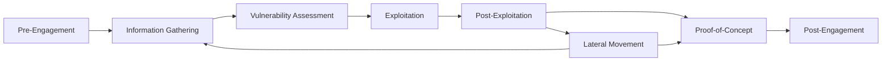
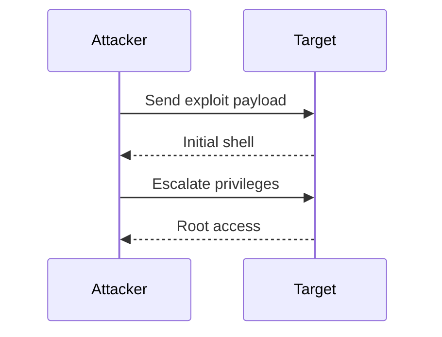
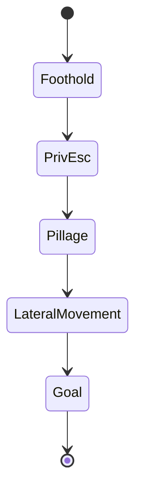

# Obsidian Features Demo

Tags: #Material

> View this in **Reading view** (Ctrl/Cmd + E) to see every effect render.

---

## Text Formatting

**Bold**, _italic_, _**bold italic**_, ~~strikethrough~~, ==highlight==, `inline code`.

Underline (needs HTML): <u>underlined text</u>.

Superscript: E=mc^2^ · Subscript: H~2~O _(may need a plugin/Pandoc)_.

---

## Headings & Horizontal Rule

# H1

## H2

### H3

#### H4

##### H5

###### H6

---

## Lists & Tasks

- Bullet item
    - Nested (2 spaces)
        - Deeper

1. Ordered item
2. Second item
    1. Nested ordered

- [ ] Unchecked task
- [x] Completed task
- [/] In progress
- [-] Cancelled
- [>] Forwarded

---

## Tables (with alignment)

|Left|Center|Right|
|:--|:-:|--:|
|a|b|c|
|Draft PR|Alice|2026-05-01|

---

## Links & Embeds

Internal: `[[Note Title]]`, `[[Note Title|Display Text]]`, `[[Note Title#Heading]]`, `[[Note Title^block-id]]`

External: [Link text](https://obsidian.md/ "Tooltip")

Embed a note: `![[Note Title]]` Embed a section: `![[Note Title#Section]]` Embed + resize image: `![[image.png|300]]` Embed a PDF page: `![[document.pdf#page=3]]`

> Embeds are shown as raw syntax here since the target files do not exist in this vault. Replace the names with real notes/files to see them render live.

---

## Block Reference

This paragraph has a linkable block ID. ^demo-block

Reference it from anywhere with: `[[Obsidian-Features-Demo#^demo-block]]`

---

## Footnotes & Comments

Standard footnote.[^1] Inline footnote.^[This is an inline footnote — Reading view only.]

[^1]: This is the referenced footnote text.

This line has an %%inline comment%% (hidden in Reading view).

%% Block comment — spans multiple lines, only visible while editing. %%

---

## Callouts
[[Obsidian Callouts]]

> [!note] Note Standard informational callout.

> [!warning] Custom title Callout with a custom header.

> [!tip]- Collapsible (folded by default) Hidden until you click it.

> [!example] Nesting
> 
> > [!bug] Step 1 Inner callout.

---

## Math (LaTeX / MathJax)

Inline: $E = mc^2$

Block:

$$ \int_{-\infty}^{\infty} e^{-x^2}, dx = \sqrt{\pi} $$

Matrix:

$$ \begin{pmatrix} a & b \ c & d \end{pmatrix} $$

---

## Mermaid — Flowchart



---

## Mermaid — Sequence Diagram



---

## Mermaid — State Diagram



---

## Code Block (syntax highlighting)

```python
from pwn import *

p = process("./vuln")
p.sendline(b"A" * 64 + p64(0xdeadbeef))
p.interactive()
```

---
